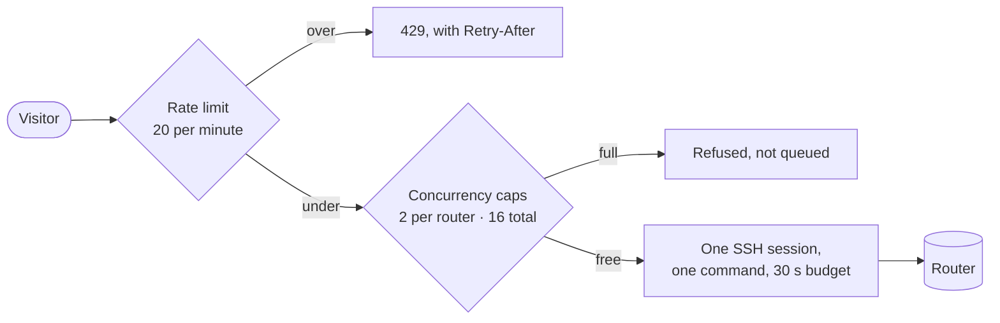

# Publishing it without regretting it

## TL;DR

Before this faces the Internet, answer one question: **what can a stranger make
my routers do?** The answer is bounded by four numbers in your configuration —
the rate limit, the two concurrency caps and the command timeout — plus a
reverse proxy in front for TLS. Everything else on this page is detail.

## What a stranger can spend

Every query costs a router's control-plane processor. That processor also runs
BGP, and a busy one drops sessions. So the interesting number is not "how many
visitors" but "how much router CPU per visitor".



Four settings bound it:

```toml
[limits]
timeout_secs = 30                 # a command that runs longer is cut
max_output_bytes = 262144         # output past this is dropped, flagged truncated
max_concurrent_per_router = 2     # one busy router cannot starve the others
max_concurrent_total = 16         # the whole instance

[rate_limit]
enabled = true
max_requests = 20                 # per visitor, per window
window_secs = 60
burst = 5
```

The defaults are deliberately low. Raise them knowing what you are spending.

**A full instance refuses rather than queues**, answering 429 with
`Retry-After`. That is on purpose: an unbounded queue is a way to keep a router
busy indefinitely, and a visitor waiting behind strangers has no idea whether
anything is happening.

## Behind a proxy, say so

NOGGlass serves plain HTTP on port 8080 as an unprivileged user. Put a proxy in
front for TLS — Cloudflare, Traefik, HAProxy, nginx, Caddy — and then **tell
NOGGlass which addresses that proxy uses**:

```toml
[rate_limit]
trusted_proxies = ["192.0.2.1", "2001:db8::1"]
```

Without this, every visitor arrives as the proxy and they **all share one
allowance**, which means one scraper exhausts the limit for everybody.
`X-Forwarded-For` is believed only from the addresses listed here; from anywhere
else it is attacker-controlled, and a rate limiter keyed on an unverified header
is a limiter with a documented bypass. NOGGlass warns at startup when a proxy is
declared and the list is empty.

## IPv6 counts by /64

A residential IPv6 connection holds an entire /64 — eighteen quintillion
addresses. Counting per address would be the same as not counting, so the limit
applies per /64. Nothing to configure; worth knowing when someone reports being
limited "for no reason" while their neighbour on the same prefix was querying.

## The two things that leave your network

Both are off by default, and both send the **prefix a visitor typed** to a third
party:

| Setting | What it sends, and where |
|---|---|
| `[rpki] enable_fallback` with no `validator_url` | Prefix and origin AS, to RIPEstat |
| `[global_view] enabled` | Prefix, to RIPEstat |

They are genuinely useful — the first fills in RPKI for routers without an RTR
session, the second is how a leak becomes visible. If you turn either on, say so
in your privacy notice. Pointing `validator_url` at your own validator keeps the
RPKI half inside your network.

## Before you publish: the checklist

- [ ] Every router account is read-only and refuses configuration mode
- [ ] Router ACLs permit SSH only from this host
- [ ] A reverse proxy terminates TLS, and its addresses are in `trusted_proxies`
- [ ] Rate limiting is on, and you know what its numbers cost in router CPU
- [ ] The mock router is removed, or clearly labelled as a demo
- [ ] Privacy notice mentions RIPEstat, if either lookup is enabled
- [ ] The startup log has no warnings you have not read

## What visitors cannot see

Worth knowing so you can answer the question when it comes: the router list
carries a name, a vendor and a location. The management address, the port, the
username and the credential variable never reach the browser, and a transport
failure renders as "could not reach the router" rather than as anything that
would describe your management network.

## Next

[When something looks wrong](9-when-something-looks-wrong.md).
