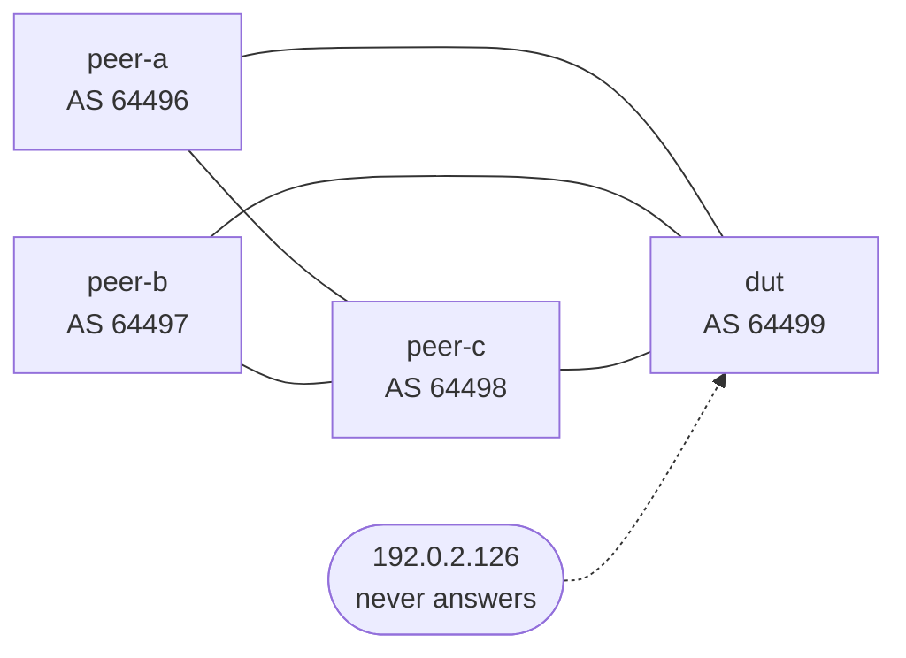

# The test lab

## TL;DR

Three BGP speakers around one device under test, in containerlab. What they
announce is designed to break parsers, not to look like a real network: a path
with eight ASNs, an aggregate with an AS_SET, one route with MED 0 and another
with no MED at all, a `/32`, a prefix carrying three kinds of community, and a
session that never comes up. Every one of those exists because a parser in this
repository got it wrong at least once.

```bash
containerlab deploy -t nogglass.clab.yml
./capture.sh --node dut --vendor frr
containerlab destroy -t nogglass.clab.yml --cleanup
```

## Why it exists

Every parser here was written from documented output. Documentation tells you
the fields; it does not tell you where a CLI wraps a long AS path, what it
prints when a value is absent, or how it marks a route learned from an
aggregate. That is what this lab produces: real text from a real routing
daemon, to write tests against.

## What is in it



The peers are FRR, which is free and small, so **only the device under test
ever needs a licensed image**. As shipped the DUT is FRR too, so the lab runs
with no vendor image at all and the capture script can be exercised end to end.

### Addressing

| Link | IPv4 | IPv6 |
|---|---|---|
| dut ↔ peer-a | `192.0.2.0/30` | `2001:db8:0:1::/64` |
| dut ↔ peer-b | `192.0.2.4/30` | `2001:db8:0:2::/64` |
| dut ↔ peer-c | `192.0.2.8/30` | `2001:db8:0:3::/64` |
| peer-a ↔ peer-c | `192.0.2.12/30` | `2001:db8:0:4::/64` |
| peer-b ↔ peer-c | `192.0.2.16/30` | `2001:db8:0:5::/64` |

Every address is from a range reserved for documentation, and every ASN from
the ranges RFC 5398 reserves — including 32-bit ones, because a driver that
reads `65536` as two numbers is a driver that has never seen one.

### What the peers announce, and why

| Prefix | Comes from | What it is there to break |
|---|---|---|
| `203.0.113.0/24` | peer-c, carried by peer-a and peer-b | Three paths for one prefix. Only one is best, and the marker for it is what the table parser has to find |
| — via peer-a | | A path of **eight ASNs**, which no CLI fits on one line. The continuation line is where parsers lose the prefix |
| — via peer-b | | MED 100 and a short path, so the best path is not the first row |
| `198.51.100.0/24` | peer-c, as an aggregate | An **AS_SET**: the path column reads `{64496,64497,65536,65543}`, which is not a list of numbers |
| `198.51.100.0/25` | peer-a | **No MED at all.** Absent is not zero (ADR-0006), and this is the half that proves it |
| `198.51.100.128/25` | peer-b | **MED 0, explicitly.** The other half |
| `198.51.100.42/32` | peer-a | A host route. A continuation line was once read as a `/32` of its own |
| `192.0.2.128/25` | peer-b | Standard, well-known (`no-export`) and large communities at once, plus a MED of 4294967294 |
| `2001:db8:beef::/48` | peer-c | The IPv6 equivalents of the above, including the long path |
| `2001:db8:beef:abcd::1/128` | peer-b | An IPv6 host route |

`203.0.113.3` and `2001:db8:beef::3` are peer-c's loopbacks, so they answer:
ping and traceroute from the DUT have a real destination two or three hops
away, rather than a timeout that teaches the parser nothing.

The DUT also has a neighbour at `192.0.2.126` that will never answer. A summary
where every session is established does not test the summary parser, and "a
number in the state column means the session is up" is exactly the rule that
needs a session which is not.

## Testing a vendor

Replace the `dut` node in `nogglass.clab.yml` with the vendor's image — the
alternatives are listed in a comment right there — give it the same three links,
and configure it with the addressing above. Then:

```bash
./capture.sh --node dut --vendor mikrotik_routeros --via ssh --user admin
```

`--vendor` is a section name from
`crates/looking-glass-core/src/catalogue/commands.toml`, and the script sends
**exactly what the product sends**, paging command included. That matters: the
paging command changes the output more than anything else in the capture.

Output lands in `captured/<vendor>/<query>.txt`, one file per command, with the
command in a comment at the top. Those files are not committed. What gets
committed is a test in the driver written from them — the fixtures in this
project live beside the parser they exercise, not in a directory of their own.

### What the lab cannot do

- **Huawei VRP and Datacom DmOS** have no public container image. Those two need
  real hardware, and until then their parsers stay unverified.
- **RPKI states** are not produced here: there is no validator in the topology,
  so the router reports nothing and NOGGlass falls back (ADR-0010). Testing the
  router-first path needs an RTR session, which is worth adding later.
- **Nokia SR Linux** is free and runs here, but it is a different CLI from the
  SR OS this project has a driver for. Running it measures what a new driver
  would cost; it does not test the existing one.

## Credentials

There are none in this directory, and none belong here. A node that needs a
password reads it from `NOGGLASS_LAB_PASSWORD` in the environment, which
`capture.sh` passes to `sshpass` through a variable rather than a command line,
so it does not appear in `ps`.
