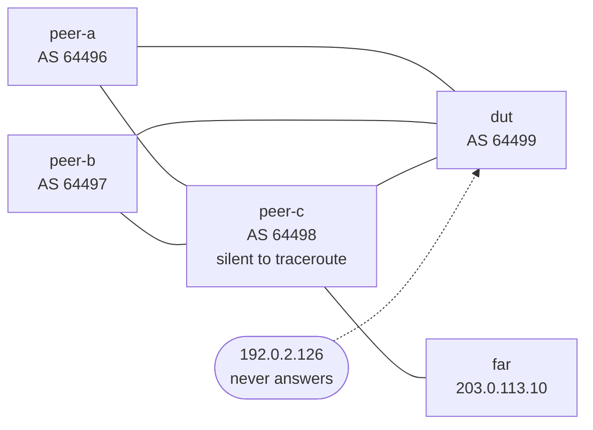

# The test lab

## TL;DR

Three BGP speakers around one device under test, in containerlab. What they
announce is designed to break parsers, not to look like a real network: a path
with eight ASNs, an aggregate with an AS_SET, one route with MED 0 and another
with no MED at all, a `/32`, a prefix carrying three kinds of community, and a
session that never comes up. Every one of those exists because a parser in this
repository got it wrong at least once.

```bash
containerlab deploy -t nogglass.clab.yml
./capture.sh --node dut --vendor frr
containerlab destroy -t nogglass.clab.yml --cleanup
```

## Why it exists

Every parser here was written from documented output. Documentation tells you
the fields; it does not tell you where a CLI wraps a long AS path, what it
prints when a value is absent, or how it marks a route learned from an
aggregate. That is what this lab produces: real text from a real routing
daemon, to write tests against.

## What is in it



The peers are FRR, which is free and small, so **only the device under test
ever needs a licensed image**. As shipped the DUT is FRR too, so the lab runs
with no vendor image at all and the capture script can be exercised end to end.

### Addressing

| Link | IPv4 | IPv6 |
|---|---|---|
| dut ↔ peer-a | `192.0.2.0/30` | `2001:db8:0:1::/64` |
| dut ↔ peer-b | `192.0.2.4/30` | `2001:db8:0:2::/64` |
| dut ↔ peer-c | `192.0.2.8/30` | `2001:db8:0:3::/64` |
| peer-a ↔ peer-c | `192.0.2.12/30` | `2001:db8:0:4::/64` |
| peer-b ↔ peer-c | `192.0.2.16/30` | `2001:db8:0:5::/64` |
| peer-c ↔ far | `192.0.2.20/30` | `2001:db8:0:6::/64` |

Every address is from a range reserved for documentation, and every ASN from
the ranges RFC 5398 reserves — including 32-bit ones, because a driver that
reads `65536` as two numbers is a driver that has never seen one.

### What the peers announce, and why

| Prefix | Comes from | What it is there to break |
|---|---|---|
| `203.0.113.0/24` | peer-c, carried by peer-a and peer-b | Three paths for one prefix. Only one is best, and the marker for it is what the table parser has to find |
| — via peer-a | | A path of **eight ASNs**, which no CLI fits on one line. The continuation line is where parsers lose the prefix |
| — via peer-b | | MED 100 and a short path, so the best path is not the first row |
| — the three together | | **Absent, zero and set, in one table.** FRR prints `metric 100`, `metric 0` and — for the path via peer-a — no metric field at all. Absent is not zero (ADR-0006), and here that is visible in a single answer |
| `198.51.100.0/24` | peer-c, as an aggregate | An **AS_SET**: the path column reads `64498 {64496,64497}`, which is not a list of numbers |
| `198.51.100.0/25` | peer-a | A 32-bit ASN in the path (`64496 65536`). A driver that reads `65536` as two numbers has never seen one |
| `198.51.100.128/25` | peer-b | **MED 0, explicitly**, and the row wraps: the prefix is long enough that the next hop lands on the following line |
| `198.51.100.42/32` | peer-a | A host route. A continuation line was once read as a `/32` of its own |
| `192.0.2.128/25` | peer-b | Standard, well-known (`no-export`) and large communities at once, plus a MED of 4294967294 |
| `2001:db8:beef::/48` | peer-c | The IPv6 equivalents of the above, including the long path |
| `2001:db8:beef:abcd::1/128` | peer-b | An IPv6 host route |

### The traceroute, which is its own trap

`203.0.113.10` and `2001:db8:beef:f::10` live on `far`, one hop beyond peer-c,
and they answer. **peer-c does not.** Its ICMP error rate limit is set to one
message every 2000 seconds, which is silence for any traceroute:

```
traceroute to 203.0.113.10 (203.0.113.10), 30 hops max
 1  *  *  *
 2  203.0.113.10  0.013 ms  0.009 ms  0.008 ms
```

The path works — a ping to the same address succeeds — and the hop in the
middle says nothing. That is not a trick: routers rate limit ICMP errors and
many operators silence them entirely, which is why a silent hop in the middle
of a healthy path is the most misread output in networking. A parser that drops
the silent hop moves where the path appears to stop, and a path that appears to
stop in the wrong place has started more wrong investigations than anything
else. Hop 1 must stay hop 1.

The DUT also has a neighbour at `192.0.2.126` that will never answer. A summary
where every session is established does not test the summary parser, and "a
number in the state column means the session is up" is exactly the rule that
needs a session which is not.

## What the device under test has to do

Two rules, both learned the hard way on the first deploy:

- **It announces nothing to the peers.** A looking glass router has no
  customers, and here it also matters mechanically: with the DUT re-advertising
  between peers, its own AS ends up inside peer-c's AS_SET, and the aggregate
  then comes back carrying 64499 — which the DUT drops as a loop. The most
  interesting route in the lab was invisible until this was fixed.
- **Sessions carry only what they are activated for.** FRR's
  `bgp default ipv4-unicast` activates every neighbour for IPv4, including the
  IPv6-addressed ones, which then carry IPv4 prefixes over an IPv6 session. That
  leak is what put 64499 in the AS_SET in the first place, and it took reading
  `from 2001:db8:0:2::1` on an IPv4 route to see it.

## One topology per vendor

The peers never change; only the device under test does. Each vendor has its own
file so a run is one command, and `conf/dut-*/` holds its configuration.

| Vendor | Topology | Image | Needs |
|---|---|---|---|
| FRR (reference) | `nogglass.clab.yml` | `quay.io/frrouting/frr:9.1.0` | Nothing. Runs anywhere, no licence, no KVM |
| BIRD | `bird.clab.yml` | built from `conf/dut-bird/` | Nothing |
| MikroTik RouterOS | `mikrotik.clab.yml` | `vrnetlab/mikrotik_routeros:7.16.2` | `/dev/kvm`, ~1 GB, boots in a minute |
| Huawei VRP | `huawei.clab.yml` | `vrnetlab/huawei_vrp:ne40e-8.180` | `/dev/kvm`, 4 GB, boots in four minutes |
| Cisco IOS-XE | `iosxe.clab.yml` | `vrnetlab/cisco_csr1000v:17.03.08a` | `/dev/kvm`, 4 GB, boots in five minutes |
| Cisco IOS-XR | `iosxr.clab.yml` | `vrnetlab/cisco_xrv9k:7.7.1` | `/dev/kvm`, 24 GB — **does not finish booting here**, see below |
| Juniper | `vmx.clab.yml`, `junos.clab.yml` | `vrnetlab/juniper_vmx`, `vrnetlab/juniper_vjunos-switch` | `/dev/kvm`, 6 GB — **neither routes here**, see below |

Deploy one at a time. Two of these want most of a lab host to themselves:

```bash
containerlab deploy -t iosxe.clab.yml
./capture.sh --node dut --host <mgmt-ip> --user admin --vendor cisco_iosxe --via ssh
containerlab destroy -t iosxe.clab.yml --cleanup
```

## Building the images

None of the vendor images comes ready. [vrnetlab](https://github.com/srl-labs/vrnetlab)
turns a vendor's disk image into a container; clone it, put the disk in the
vendor's directory, and run `make`.

Where `make` is not available — as on this machine — the same thing is two
commands, since the Makefile only copies the shared files in and runs a build:

```bash
cp ../../common/* docker/
cp <disk image> docker/
cd docker && docker build --build-arg IMAGE=<disk image> --build-arg VERSION=<version>     -t vrnetlab/<vendor>_<platform>:<version> .
```

Two need more than that:

- **Cisco CSR1000v** boots once during the build to be told to use the serial
  console, then is committed as a new image. Without `make`:
  `docker run --cidfile cid --privileged --device /dev/kvm <image> --trace --install`,
  wait for it to exit, then
  `docker commit --change='ENTRYPOINT ["uv", "run", "/launch.py"]' $(cat cid) <image>`.
- **vJunos** has a step that patches the disk for AMD hosts. On an Intel host it
  is not needed and the plain build works.

Images are not in this repository and will not be. They are large, they are
licensed, and a lab image in a git history is a licence problem that outlives
the lab.

## What each device wants, which is not in its documentation

Driving these is a separate skill from parsing them, and each of these cost an
afternoon to find.

**Huawei VRP** runs in two-stage commit: the prompt turns from `[~dut]` to
`[*dut]` when there are pending changes and it refuses to leave configuration
mode without `commit`. Its CLI also **drops input that arrives faster than it
echoes** — a configuration fed in one burst stalls halfway, while the same lines
sent one at a time with a pause go in. And paging must be turned off **in the
same session** as the query: sent as its own connection it does nothing.

**vMX** types its startup configuration into the CLI line by line, so the file
must be `set` commands with **no comments** — a comment is typed as a command
and the load fails with `unknown command`.

**vJunos-switch** does the opposite: it appends the file to its own
configuration, so the same content must be in **hierarchical** format. A file of
`set` commands makes the whole configuration a syntax error, the router boots on
its factory configuration with no user and no SSH, and it looks like a boot
failure rather than a bad file.

**Every device under test must announce nothing to the peers.** A looking glass
router has no customers, and here it also matters mechanically: with the DUT
re-advertising between peers, its own AS lands inside peer-c's AS_SET, the
aggregate comes back carrying it, and the router drops it as a loop — so the
most interesting route in the lab disappears. Each `conf/dut-*` does this in its
own dialect: a `deny` route-map on FRR and IOS-XE, a `reject` filter chain on
RouterOS, a `deny node 10` route-policy on VRP, `then reject` on Junos.

## What does not work here, and why

**Cisco IOS-XR.** The XRv9k image builds and starts, and its admin VM reports
`calvados bootup timer expired` until it gives up. XRv9k runs virtual machines
inside the one it is given; on a lab host that is itself a virtual machine that
is a third level of nesting, and it is too slow to meet its own timers. A
bare-metal host would settle it, and so would Cisco's container-native XRd.

**Juniper.** Two images, neither routes. vJunos-switch boots and answers on SSH,
but its forwarding plane is a virtual machine inside the virtual machine and
never comes up — `show chassis fpc` reports slot 0 `Present/Absent`, no `ge-`
interfaces exist, and it warns that BGP needs a licence. A vMX assembled from
separate VCP and VFP disks boots its routing engine, gives a CLI on the console,
has no `fxp0`, and answers `show bgp summary` with `the routing subsystem is not
running`: those disks are packaged for a different hypervisor layout than
vrnetlab drives. Juniper's own `vmx-bundle-*.tgz` is what that build expects.

## Testing a vendor not listed above

Replace the `dut` node in `nogglass.clab.yml` with the vendor's image — the
alternatives are listed in a comment right there — give it the same three links,
and configure it with the addressing above. Then:

```bash
./capture.sh --node dut --vendor mikrotik_routeros --via ssh --user admin
```

`--vendor` is a section name from
`crates/looking-glass-core/src/catalogue/commands.toml`, and the script sends
**exactly what the product sends**, paging command included. That matters: the
paging command changes the output more than anything else in the capture.

Output lands in `captured/<vendor>/<query>.txt`, one file per command, with the
command in a comment at the top. Those files are not committed. What gets
committed is a test in the driver written from them — the fixtures in this
project live beside the parser they exercise, not in a directory of their own.

### What the lab cannot do

- **Huawei VRP and Datacom DmOS** have no public container image. Those two need
  real hardware, and until then their parsers stay unverified.
- **RPKI states** are not produced here: there is no validator in the topology,
  so the router reports nothing and NOGGlass falls back (ADR-0010). Testing the
  router-first path needs an RTR session, which is worth adding later.
- **Nokia SR Linux** is free and runs here, but it is a different CLI from the
  SR OS this project has a driver for. Running it measures what a new driver
  would cost; it does not test the existing one.

## Credentials

There are none in this directory, and none belong here. A node that needs a
password reads it from `NOGGLASS_LAB_PASSWORD` in the environment, which
`capture.sh` passes to `sshpass` through a variable rather than a command line,
so it does not appear in `ps`.
